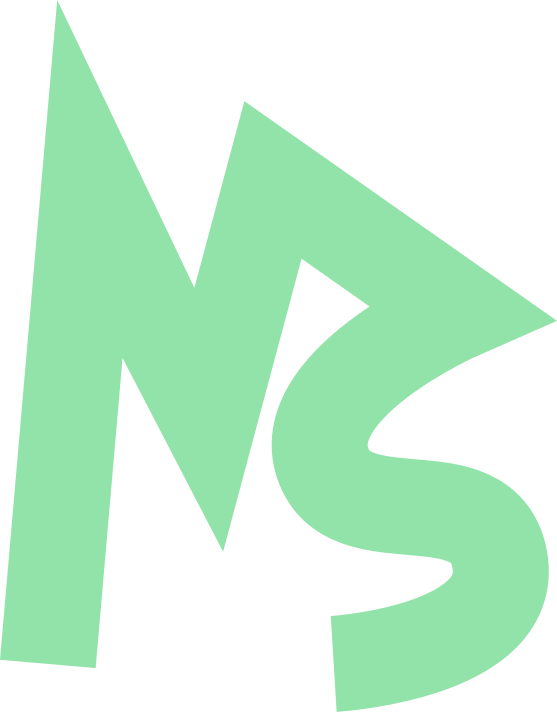

<div align="center">



# Makeshift Blog

**The engineering blog for Makeshift Engineering, built with Astro, MDX, and Keystatic CMS.**

_High-performance static rendering combined with React-powered interactive visualization islands and zero-git publishing._

[](https://github.com/makeshift-engineering/makeshift-blog/actions/workflows/build.yml)
[](https://github.com/makeshift-engineering/makeshift-blog/actions/workflows/lint.yml)

</div>

---

## 1. Project Overview & Architecture

Makeshift Blog is designed to match the custom, dark-themed design language of the main [makeshift.pro](https://makeshift.pro) website. Key design principles and technology choices include:

- **Static-First Framework**: Built on [Astro 5](https://astro.build/) with the new Content Layer API for lightning-fast, SEO-optimized page loads.
- **Interactive Islands**: Uses `@astrojs/react` to embed rich, interactive visualizations (like LSM-Tree write paths) directly inside MDX posts.
- **Git-Backed CMS**: Integrated with [Keystatic](https://keystatic.com/). The local admin UI allows editors to write content with an intuitive editor, generating colocated directory posts under `src/content/blog/` automatically.
- **Modern Styling**: Powered by a unified vanilla CSS token system (`src/styles/design-tokens.css`) that's ready to be extracted into a shared `@makeshift/ui` package in the future.

---

## 2. Project Structure

We follow a colocated content model. All media, components, and code related to a specific post live together inside that post's directory:

```plaintext
makeshift-blog/
├── .github/workflows/
│   ├── build.yml          # CI build workflow
│   └── lint.yml           # ESLint & Prettier check workflow
├── public/
│   ├── favicon.svg        # Brand icon
│   └── robots.txt
├── src/
│   ├── content/
│   │   └── blog/          # Post-specific directories
│   │       └── building-an-lsm-tree/
│   │           ├── index.mdx
│   │           ├── LSMTreeVisualization.tsx
│   │           └── memtable-diagram.png
│   ├── components/        # Shared components (Navbar, Footer, etc.)
│   ├── layouts/           # Page layouts (BaseLayout, PostLayout)
│   ├── pages/             # Page routing and RSS feeds
│   └── styles/            # CSS variables and styling tokens
├── astro.config.ts        # Astro configuration
└── keystatic.config.ts    # Keystatic configuration
```

---

## 3. Development Workflow

### Prerequisites

Ensure you have [Bun](https://bun.sh/) installed:

```bash
# Verify bun installation
bun --version
```

### Setup & Installation

1. Clone the repository and navigate to the directory:
   ```bash
   git clone https://github.com/makeshift-engineering/makeshift-blog.git makeshift-blog
   cd makeshift-blog
   ```
2. Install the required dependencies:
   ```bash
   bun install --frozen-lockfile
   ```

### Running Locally

To start the local development server:

```bash
bun run dev
```

The server will start at [http://localhost:4321](http://localhost:4321).
If a previous server instance is already running on port `4321`, you can replace it by running:

```bash
bun run dev --force
```

## 4. Linting and Formatting

We use **ESLint** (with TypeScript and Astro flat config plugins) and **Prettier** to maintain a clean codebase. These are run automatically on CI/CD but can be run locally:

### Run Code Checkers

Check code styles and formatting issues:

```bash
# Check formatting
bun run format

# Run linter
bun run lint
```

### Auto-fix Formatting Issues

To automatically format files:

```bash
bun run format:fix
```

---

## 5. Build and Deployment

### Production Build

Build the project locally for production:

```bash
bun run build
```

This compiles the static routes and generates the server entry points inside the `dist/` directory.

### Deployment on Netlify

The blog is optimized for deployment on Netlify using `@astrojs/netlify`. Netlify renders the site statically, except for the Keystatic Admin API endpoints (`/keystatic` and `/api/keystatic/*`) which use Netlify functions for GitHub oauth:

1. Push your changes to GitHub.
2. Link the repository to your Netlify dashboard.
3. Configure the environment variables for your Keystatic GitHub App in Netlify.

---

## 6. License

This project is licensed under the **Makeshift Engineering Non-Commercial License**. You are free to clone and use this repository for personal, educational, and individual exploration, provided that you credit **Makeshift Engineering** and link back to [makeshift.pro](https://makeshift.pro). Commercial use is strictly prohibited. See the [LICENSE](LICENSE) file for the full license terms.
